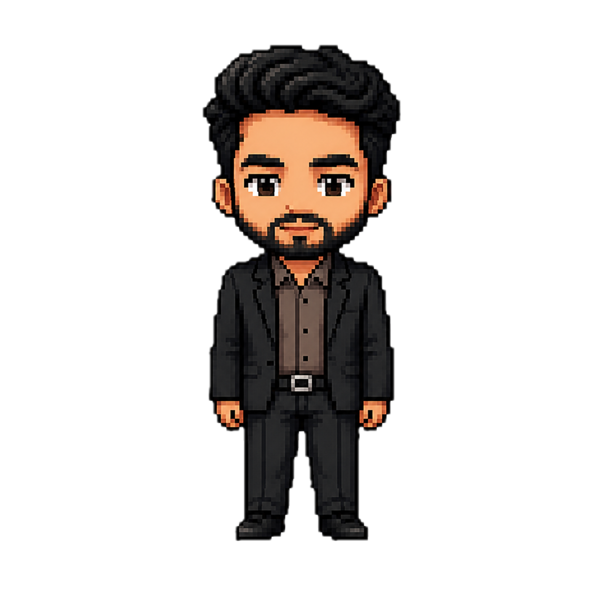

<p align="center">
  
</p>

<h1 align="center">💧 Water Buddy</h1>

<p align="center">
  <strong>A cute pixel-art desktop pet that reminds you to drink water!</strong>
  <br>
  <em>Built with Python & PyQt6 • macOS Native • Transparent & Always-on-Top</em>
</p>

<p align="center">
  
  
  
  
</p>

---

## 🌟 What is Water Buddy?

Water Buddy is a **desktop pet application** that lives on your screen and gently reminds you to stay hydrated. A cute pixel-art character slides in from the corner of your screen every 30 minutes and asks:

> 💧 *"Hey! Did you drink water?"*

Click **"Yes"** and it celebrates! Click **"Snooze"** and it comes back later. Simple, adorable, and effective.

---

## ✨ Features

| Feature | Description |
|---------|-------------|
| 🎨 **Pixel Art Pet** | Custom-designed pixel art character with walking animations |
| 💬 **Speech Bubbles** | Cute chat bubbles with personalized messages |
| ⏰ **Smart Reminders** | Configurable intervals (default: 30 min) |
| 😴 **Snooze** | "Remind me later" with configurable duration |
| 🔔 **Sound Alerts** | Water-drop notification sound when pet appears |
| 💧 **System Tray** | Menu bar icon for quick access |
| ⚙️ **Settings** | Beautiful dark-themed settings window |
| 📊 **Stats Tracking** | Daily intake count, streaks, and progress bar |
| 🔇 **Quiet Hours** | No interruptions during sleep (e.g., 10 PM – 7 AM) |
| 🚀 **Launch at Login** | Auto-start when your Mac boots up |
| 👤 **Personalized** | Custom name in greeting messages |

---

## 🎬 How It Works

Water Buddy follows a **State Machine** pattern. Here's the complete lifecycle:

<p align="center">
  
</p>

### The Flow:

```
1. 🫥 HIDDEN        → App starts, pet is invisible. Timer counting down.
2. 🚶 WALKING_IN    → Timer fires! Pet slides in from the right edge.
3. ❓ ASKING        → Pet stops. Speech bubble: "Did you drink water?"
4a. 🎉 REJOICING    → User clicks "Yes" → "Good job!" + happy dance
4b. 😤 SAD          → User clicks "Snooze" → "Fine... I'll come back!"
5. 🚶 WALKING_OUT   → Pet slides out to the right
6. 🫥 HIDDEN        → Back to step 1. Loop repeats forever.
```

### Timer Defaults:

| Timer | Duration | Configurable? |
|-------|----------|:------------:|
| Main Reminder | 30 minutes | ✅ (5–120 min) |
| Snooze | 5 minutes | ✅ (1–30 min) |
| "Good Job" display | 2.5 seconds | — |
| "Fine..." display | 2.0 seconds | — |

---

## 🖼️ Pixel Art Assets

All images were generated using **ChatGPT's image generation** (DALL·E). Below are the prompts used to create each asset. You can use these prompts to create your own custom character!

### 🧙 Master Prompt (Read This First)

> **What we're building:** A set of 11 pixel-art sprite images for a desktop pet app called "Water Buddy." The character is a small, cute, humanoid pixel figure. All images must share the **exact same art style, color palette, proportions, and pixel density** so they look like frames from the same game.
>
> **Rules for every image:**
> - 32-bit retro pixel art style (think Stardew Valley / Undertale)
> - Canvas size: 512×512 pixels
> - Transparent (checkerboard) background
> - The character should be centered and occupy roughly 60–70% of the canvas
> - Consistent line thickness, shading, and color palette across ALL images
> - No anti-aliasing (hard pixel edges only)

---

### Individual Image Prompts

<details>
<summary><strong>🧍 idle.png</strong> — Standing still, neutral pose</summary>

```
Create a 32-bit retro pixel art character standing in a neutral idle pose.
The character is a small cute humanoid with simple features.
Style: Stardew Valley / Undertale pixel art.
512x512 canvas, transparent background, hard pixel edges, no anti-aliasing.
The character should look friendly and approachable, standing facing forward
with arms at their sides.
```
</details>

<details>
<summary><strong>😊 happy.png</strong> — Celebrating after user drinks water</summary>

```
Create a 32-bit retro pixel art character in a happy/celebrating pose.
The character is jumping slightly with arms raised, big smile, and sparkle
effects around them. Same character design as the idle pose.
Style: Stardew Valley / Undertale pixel art.
512x512 canvas, transparent background, hard pixel edges, no anti-aliasing.
Add small star/sparkle particles around the character to show excitement.
```
</details>

<details>
<summary><strong>😠 angry.png</strong> — Frustrated when user snoozes</summary>

```
Create a 32-bit retro pixel art character looking annoyed/frustrated.
The character has puffed cheeks, furrowed brows, arms crossed, and a small
angry cloud above their head. Same character design as the idle pose.
Style: Stardew Valley / Undertale pixel art.
512x512 canvas, transparent background, hard pixel edges, no anti-aliasing.
The expression should be cute-angry (tsundere), not actually scary.
```
</details>

<details>
<summary><strong>🚶 walk_in1.png to walk_in4.png</strong> — Walking in animation (4 frames)</summary>

```
Create a 4-frame walk cycle for a 32-bit retro pixel art character walking
to the LEFT. Each frame should show a different step in the walk cycle:
Frame 1: Right foot forward, left arm forward
Frame 2: Feet together (passing position)
Frame 3: Left foot forward, right arm forward
Frame 4: Feet together (passing position, opposite to frame 2)
Same character design as the idle pose.
Style: Stardew Valley / Undertale pixel art.
512x512 canvas, transparent background, hard pixel edges, no anti-aliasing.
Generate each frame as a SEPARATE image.
```
</details>

<details>
<summary><strong>🚶 walk_out1.png to walk_out4.png</strong> — Walking out animation (4 frames)</summary>

```
Create a 4-frame walk cycle for a 32-bit retro pixel art character walking
to the RIGHT. Each frame should show a different step in the walk cycle.
The character should be facing/moving RIGHT (mirrored version of walk-in).
Same character design as the idle pose.
Style: Stardew Valley / Undertale pixel art.
512x512 canvas, transparent background, hard pixel edges, no anti-aliasing.
Generate each frame as a SEPARATE image.
```
</details>

### 📁 Complete Asset List

```
assets/
├── idle.png          # Standing still (neutral)
├── happy.png         # Celebrating (user drank water!)
├── angry.png         # Frustrated (user snoozed)
├── walk_in1.png      # Walk-in frame 1
├── walk_in2.png      # Walk-in frame 2
├── walk_in3.png      # Walk-in frame 3
├── walk_in4.png      # Walk-in frame 4
├── walk_out1.png     # Walk-out frame 1
├── walk_out2.png     # Walk-out frame 2
├── walk_out3.png     # Walk-out frame 3
├── walk_out4.png     # Walk-out frame 4
├── notification.wav  # Water-drop sound effect
└── state_machine.svg   # State machine diagram
```

---

## 🚀 Getting Started

### Prerequisites

- **macOS** (tested on macOS Sonoma / Apple Silicon)
- **Python 3.9+**

### Installation

```bash
# 1. Clone the repository
git clone https://github.com/YOUR_USERNAME/water-buddy.git
cd water-buddy

# 2. Create a virtual environment
python3 -m venv .venv
source .venv/bin/activate

# 3. Install dependencies
pip install -r requirements.txt

# 4. Run the app!
python main.py
```

### What happens next?

1. A 💧 **water drop icon** appears in your Mac's **menu bar** (top-right)
2. After 30 minutes, your pixel pet **slides in** from the bottom-right
3. It asks you: *"Did you drink water?"*
4. Click **Yes** or **Snooze** and it walks away!

---

## ⚙️ Configuration

### System Tray Menu (💧 in menu bar)

| Option | What it does |
|--------|-------------|
| ⏸️ Pause Reminders | Temporarily stop all reminders |
| 💧 Drink Now! | Record a glass without waiting for the pet |
| ⚙️ Settings... | Open the settings window |
| 📊 Today's Stats | View your daily progress |
| ❌ Quit | Exit Water Buddy |

### Settings Window

All settings are saved to `settings.json` and persist between restarts.

| Setting | Default | Range |
|---------|---------|-------|
| Reminder Interval | 30 min | 5–120 min |
| Snooze Duration | 5 min | 1–30 min |
| Quiet Hours | Off | Any time range |
| Sound | On | On/Off |
| Launch at Login | Off | On/Off |
| Your Name | "Buddy" | Any text |

### Stats Tracking

Stats are saved to `stats.json` and include:

- **Daily count**: How many glasses you drank today
- **Drink times**: When you drank each glass
- **Streak**: Consecutive days meeting your daily goal
- **Daily goal**: Configurable (default: 8 glasses)

---

## 📁 Project Structure

```
water-buddy/
├── main.py              # App controller & state machine
├── ui.py                # Desktop pet window (PyQt6)
├── animations.py        # Sprite animation engine
├── reminder.py          # Timer with quiet hours & pause
├── settings.py          # JSON settings persistence
├── settings_window.py   # Settings & stats dialog UI
├── stats.py             # Daily water intake tracker
├── tray.py              # System tray icon & menu
├── requirements.txt     # Python dependencies
├── settings.json        # User preferences (auto-created)
├── stats.json           # Intake statistics (auto-created)
└── assets/
    ├── idle.png
    ├── happy.png
    ├── angry.png
    ├── walk_in[1-4].png
    ├── walk_out[1-4].png
    ├── notification.wav
    └── state_machine.svg
```

---

## 🏗️ Architecture

```
┌─────────────────────────────────────────────────────┐
│                    AppController                     │
│               (main.py - State Machine)              │
│                                                      │
│  ┌──────────┐  ┌──────────┐  ┌───────────────────┐  │
│  │   UI     │  │ Reminder │  │   System Tray     │  │
│  │ (ui.py)  │  │(reminder │  │   (tray.py)       │  │
│  │          │  │  .py)    │  │                    │  │
│  └────┬─────┘  └────┬─────┘  └────────┬──────────┘  │
│       │              │                 │              │
│  ┌────┴─────┐  ┌────┴─────┐  ┌────────┴──────────┐  │
│  │Animation │  │ Settings │  │  Settings Window   │  │
│  │(animation│  │(settings │  │ (settings_window   │  │
│  │ s.py)    │  │  .py)    │  │       .py)         │  │
│  └──────────┘  └──────────┘  └───────────────────┘  │
│                                                      │
│                 ┌──────────┐                         │
│                 │  Stats   │                         │
│                 │(stats.py)│                         │
│                 └──────────┘                         │
└─────────────────────────────────────────────────────┘
```

### How the modules connect:

| Module | Role | Talks to |
|--------|------|----------|
| `main.py` | Brain — controls state transitions | Everything |
| `ui.py` | Pet window — speech bubbles & buttons | `main.py` |
| `animations.py` | Loads & plays sprite frames | `ui.py` |
| `reminder.py` | Fires timers, respects quiet hours | `settings.py` |
| `settings.py` | Reads/writes `settings.json` | All modules |
| `stats.py` | Tracks drinks, streaks, goals | `settings_window.py` |
| `tray.py` | Menu bar icon & dropdown actions | `main.py` |
| `settings_window.py` | Settings UI with tabs | `settings.py`, `stats.py` |

---

## 🎨 Customizing Your Pet

Want to use your own character? Just replace the images in `assets/`!

### Requirements for custom images:

- **Format**: PNG with transparent background
- **Recommended size**: 512×512 pixels (will be scaled to 220×220)
- **Must have**: `idle.png`, `happy.png`, `angry.png`
- **Walk animations**: 4 frames each for `walk_in` and `walk_out`

### Creating images with ChatGPT:

1. Go to [ChatGPT](https://chat.openai.com)
2. Upload your reference image (if you have one)
3. Use the prompts from the [Pixel Art Assets](#️-pixel-art-assets) section above
4. Download each generated image
5. Rename them to match the filenames listed above
6. Drop them into the `assets/` folder

---

## 🛑 How to Quit

There are **3 ways** to close Water Buddy:

1. **From the menu bar**: Click the 💧 icon → **❌ Quit**
2. **From terminal**: Press `Ctrl+C` in the terminal where it's running
3. **From Activity Monitor**: Search for "Python" and force quit

---

## 🧪 Tech Stack

| Technology | Why? |
|-----------|------|
| **Python 3.9** | Simple, readable, cross-platform |
| **PyQt6** | Native macOS rendering (no Tkinter dark-mode bugs!) |
| **QSystemTrayIcon** | Menu bar integration |
| **QSoundEffect** | Notification sounds |
| **JSON** | Settings & stats persistence |
| **LaunchAgents** | macOS auto-start at login |

### Why PyQt6 instead of Tkinter?

We originally built this with Tkinter + CustomTkinter, but macOS has severe bugs with Tkinter:
- 🐛 Dark Mode turns all widgets black
- 🐛 `overrideredirect(True)` makes windows invisible
- 🐛 Large PNG images fail to render on Apple Silicon
- 🐛 `systemTransparent` causes complete window disappearance

PyQt6 uses **native Qt/Cocoa rendering**, which works flawlessly on macOS.

---

## 📝 License

This project is open source and available under the [MIT License](LICENSE).

---

## 💖 Credits

- **Pixel Art**: Generated using ChatGPT (DALL·E)
- **Sound Effect**: Programmatically generated water-drop synthesis
- **State Machine Diagram**: Auto-generated SVG

---

<p align="center">
  <strong>Stay hydrated! 💧</strong>
  <br>
  <em>Made with ❤️ by a developer who kept forgetting to drink water</em>
</p>
